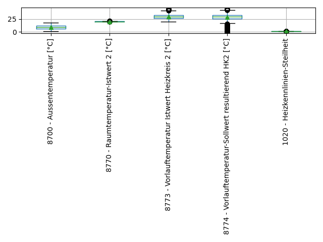
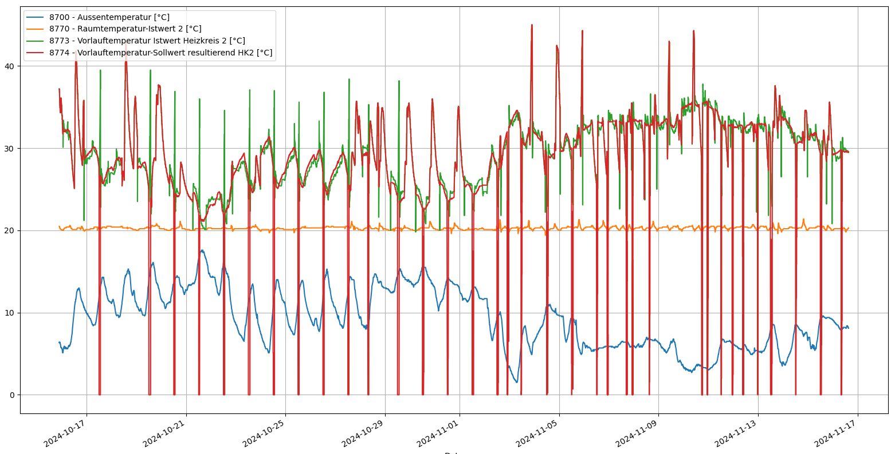
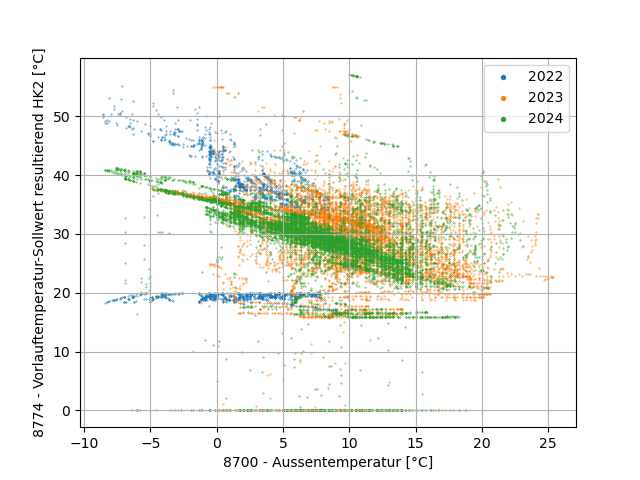
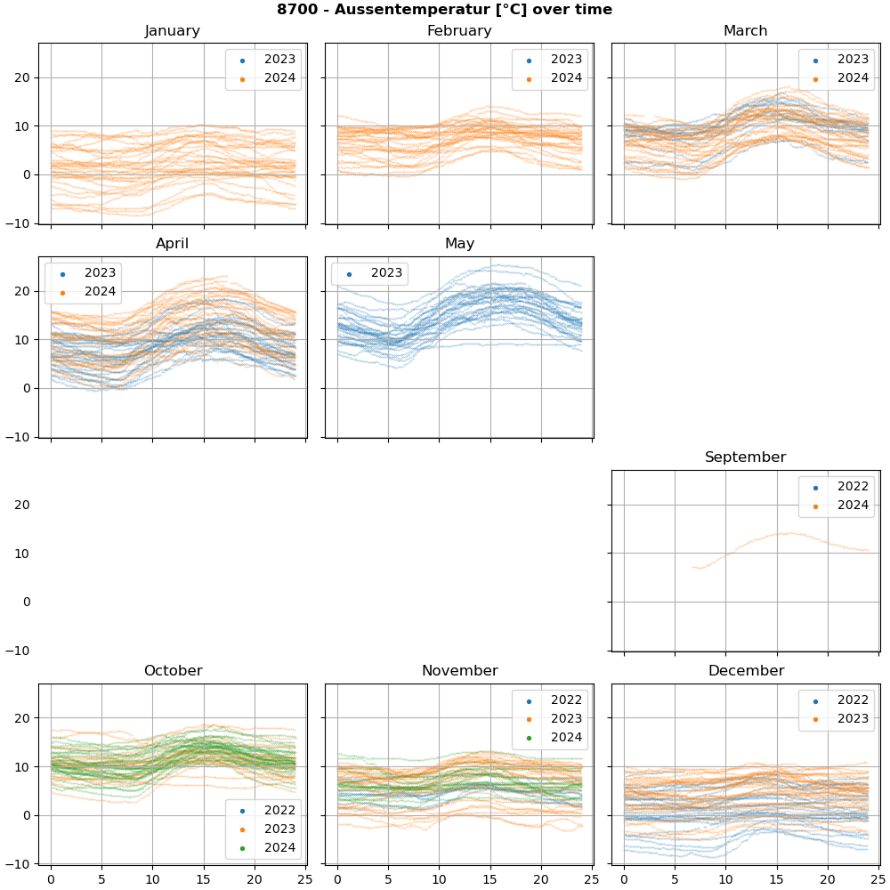
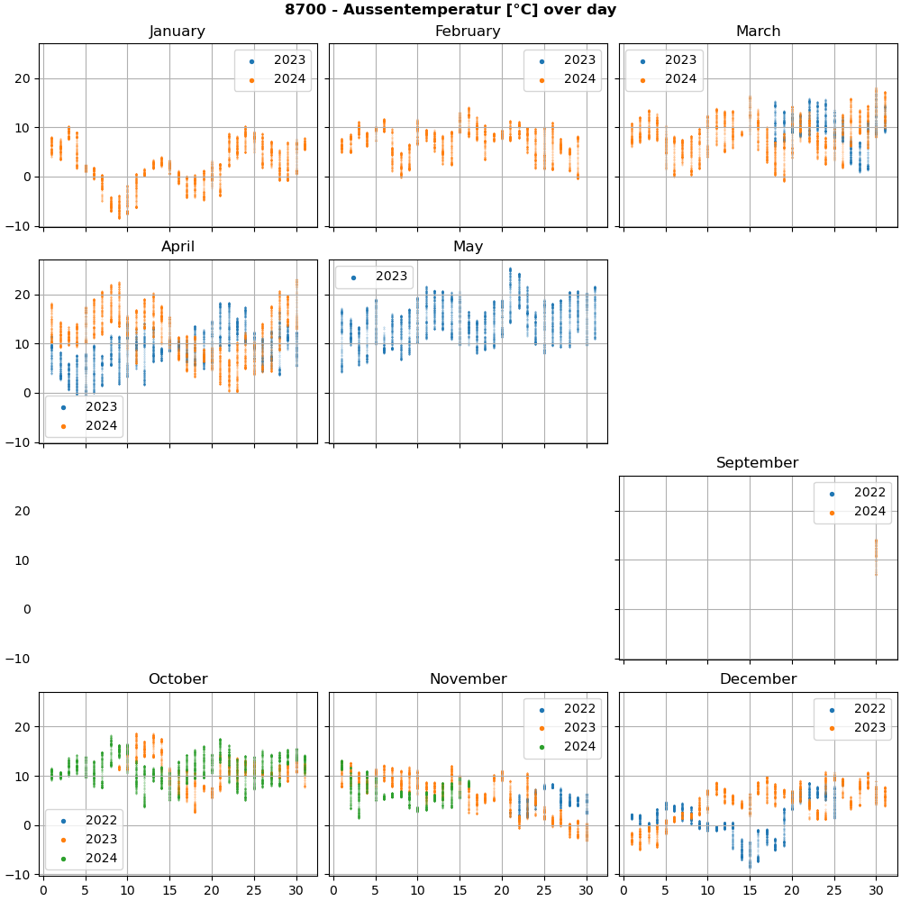

# BSB-LAN_evaluate_datalogs.py

*Example code to show how BSB-LAN's /D datalogs could be processed using
Python, including conversion to pivoted \*.csv and some plot ideas*

## Data transformation

BSB-LAN's /D datalogs come in a format with each parameter reading in
a separate line, and the parameter's name in a column of the lines.
For most (?) purposes, a pivoted format is more useful. The example
code provided here does this transformation, e.g. from this:

```
Milliseconds;Date;Parameter;Description;Value;Unit
1235285616;16.11.2024 15:32:22;8700;Aussentemperatur;8.0;°C
1235285807;16.11.2024 15:32:22;8770;Raumtemperatur-Istwert 2;20.3;°C
1235285996;16.11.2024 15:32:22;8773;Vorlauftemperatur Istwert Heizkreis 2;29.5;°C
1235286180;16.11.2024 15:32:22;8774;Vorlauftemperatur-Sollwert resultierend HK2;29.6;°C
1235286363;16.11.2024 15:32:22;1020;Heizkennlinien-Steilheit;1.36;
1235886587;16.11.2024 15:42:23;8700;Aussentemperatur;8.0;°C
1235886775;16.11.2024 15:42:23;8770;Raumtemperatur-Istwert 2;20.3;°C
1235886959;16.11.2024 15:42:23;8773;Vorlauftemperatur Istwert Heizkreis 2;29.5;°C
1235887155;16.11.2024 15:42:23;8774;Vorlauftemperatur-Sollwert resultierend HK2;29.6;°C
```

... to this (CSV format example; uncomment `df.to_csv([...]` line to save the pivoted
data in this format for processing with another program, or use `df.to_pickle` if you
want to load the transformed data again with Python later on):

```
Date,8700 - Aussentemperatur [°C],8770 - Raumtemperatur-Istwert 2 [°C],8773 - Vorlauftemperatur Istwert Heizkreis 2 [°C],8774 - Vorlauftemperatur-Sollwert resultierend HK2 [°C],1020 - Heizkennlinien-Steilheit
2024-11-16 15:32:22,8.0,20.3,29.5,29.6,1.36
2024-11-16 15:42:23,8.0,20.3,29.5,29.6,
```

## Example applications

The provided Python script also includes some examples on how the data could be
processed/analyzed. To see them applied to your data, just execute the script!
For that, you can either provide the names of files containing BSB-LAN /D datalogs;
if you don't the script will try to load it directly from `http://bsb-lan/D`.

### Statistical overview

(Use `print(df.describe())` for a textual representation. Due to the long parameter
names, the boxplots become a bit squashed here.)



### Similar to BSB-LAN's /DG display

...but with the option to filter to your liking, e.g. via `.query()`.
(Look into the code for examples on how to use `.query()`.)



### If you have data spanning multiple years (or at least months)

As you can see in the "calendar" views below, I had data for some months in
multiple years available.



---



---


